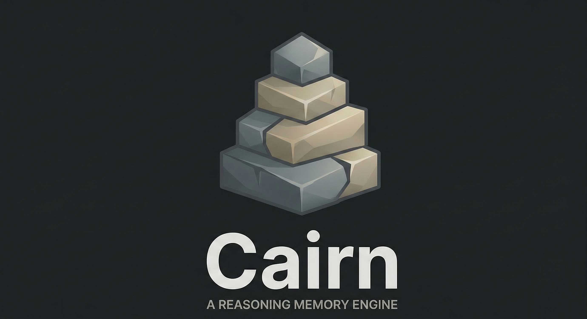

<p align="center">
  
</p>

# Cairn

Your AI knows what you said. It doesn't know what you decided.

AI memory stores content -- what was discussed, what was mentioned, what came up. None of it stores cognitive structure: which positions are settled, which were rejected and why, which questions are still open. Ask an AI about something you resolved three sessions ago and it surfaces everything -- proposal and rejection, old draft and final decision -- with equal weight and no sense of which is current.

Cairn maintains a typed reasoning graph -- propositions, contradictions, refinements, syntheses, tensions -- with confidence scores and lifecycle status. An LLM with access to this graph knows *the state of your thinking*, not just a flat log of things you said.

---

## Quick Start

```bash
git clone <repo-url> cairn && cd cairn
python -m venv .venv && source .venv/bin/activate
pip install -e ".[dev]"
```

Create `.env.local` with your API keys:
```
ANTHROPIC_API_KEY=sk-ant-...
VOYAGE_API_KEY=pa-...
```

Cairn has two integration surfaces. Choose the one that matches how you work.

---

## Using cairn with Claude Code

If you use Claude Code as your AI development tool, cairn integrates via hooks and an MCP server. No application code required.

**Stop hook** -- captures every conversation automatically. Add to `.claude/settings.json`:
```json
{
  "hooks": {
    "Stop": [{
      "type": "command",
      "command": "/path/to/cairn/.venv/bin/python /path/to/cairn/scripts/hook_ingest.py"
    }]
  }
}
```

**Orient hook** -- searches the graph for relevant prior reasoning and injects it into context before the model responds. Add to `.claude/settings.json` alongside the Stop hook:
```json
{
  "hooks": {
    "UserPromptSubmit": [{
      "type": "command",
      "command": "/path/to/cairn/.venv/bin/python /path/to/cairn/scripts/hook_orient.py"
    }]
  }
}
```

**MCP server** -- exposes the graph as queryable tools for deeper exploration (decision history, trace, disagreement map). Add to `.mcp.json` in your project root:
```json
{
  "mcpServers": {
    "cairn": {
      "command": "/path/to/cairn/.venv/bin/python",
      "args": ["-m", "cairn.mcp_server"],
      "cwd": "/path/to/cairn",
      "env": { "CAIRN_DB": "/path/to/cairn/cairn.db" }
    }
  }
}
```

Replace `/path/to/cairn` with the absolute path where you cloned the repo.

### MCP Tools

| Tool | When to use it |
|------|---------------|
| `harness_orient(topic)` | Before answering on any topic discussed in prior sessions |
| `harness_query('decision_log')` | "What did we decide about X?" |
| `harness_query('current_state')` | "Where do things stand overall?" |
| `harness_query('disagreement_map')` | "What's still unresolved?" |
| `harness_search(query)` | Find specific nodes before re-opening a discussion |
| `harness_status` | Quick graph overview at session start |
| `harness_trace(node_id)` | "How did we arrive at this position?" |

### What you'll see

After a few conversations, `harness_status` returns the current state of your reasoning graph:

```
## Graph Stats
  total_nodes: 42
  total_edges: 38
  active: 35
  resolved: 5
  propositions: 28
  questions: 8
  tensions: 2

## Active Propositions
- [a1b2c3d4e5f6] (confidence: 0.8, support: 2, challenges: 0)
  Ship with project-level .mcp.json as the default configuration
- [b2c3d4e5f6a1] (confidence: 0.7, support: 1, challenges: 1)
  SQLite is sufficient for single-user deployment

## Open Questions
- [c3d4e5f6a1b2] Does the classifier correctly handle purely operational
  exchanges (no reasoning content) by producing zero events?

## Syntheses
- [d4e5f6a1b2c3] The event log is the truth; the graph is a derived view.
  Any node's current status is computed from the full chain of events
  that touch it.
```

---

## Using cairn in your own application

If you're building an agent or application with the Anthropic SDK, cairn integrates as a library. You control the capture and retrieval loop.

**Capture** -- one import change. Every `messages.create()` and `messages.stream()` call auto-ingests into the graph as a background task.

```python
# Before
from anthropic import AsyncAnthropic

# After
from cairn.integrations.anthropic import AsyncAnthropic
```

**Retrieval** -- query the graph before each turn and inject context into the system prompt. You decide when and how to orient.

```python
import cairn
cairn.init(db_path="./my_project.db")  # or set CAIRN_DB env var
```

For a complete agent loop with automatic orientation before each turn, see [examples/agent_loop.py](examples/agent_loop.py).

---

## How It Works

Every exchange runs through a classify, resolve, mutate pipeline:

```
Content
  |  [classifier]    LLM extracts typed cognitive events
  |  [resolver]      Vector search maps descriptions to existing graph nodes
  |  [mutator]       Deterministic graph mutations
  |  [vector index]  Embed new/updated nodes
  v
Event Log (immutable)  +  Reasoning Graph (derived)
```

The event log is the truth -- append-only, ordered, every typed cognitive event. The reasoning graph is a view derived from it -- nodes are ideas, edges are typed relationships, every node carries a status computed from the full event chain. Add a contradiction and the original proposal is marked superseded. The AI reads the graph, not the history.

---

## Configuration

Each user builds their own graph; the database is gitignored. For details on scoping options and how capture works across surfaces, see [docs/configuration.md](docs/configuration.md).

---

## Prerequisites

- Python 3.12+
- [ANTHROPIC_API_KEY](https://console.anthropic.com/) -- classifier LLM
- [VOYAGE_API_KEY](https://www.voyageai.com/) -- vector embeddings

## Tests

```bash
.venv/bin/python -m pytest tests/ --ignore=tests/test_integration.py --ignore=tests/integration/  # unit (no API keys)
.venv/bin/python -m pytest tests/test_integration.py                                              # integration (API)
```

---

## Further Reading

- [Beyond Retrieval: A Case for Reasoning Memory](https://shawncady.substack.com/p/beyond-retrieval-a-case-for-reasoning) -- the full argument

## License

MIT
