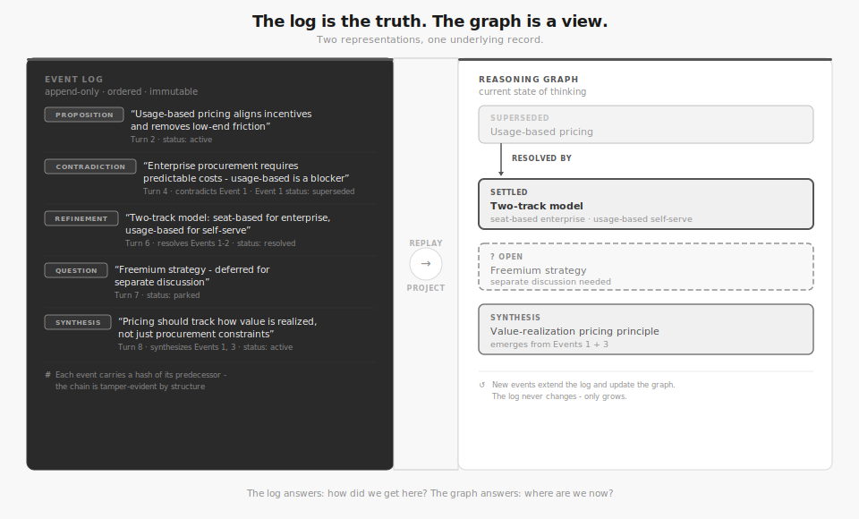

# Architecture

Cairn maintains a persistent reasoning graph and uses a multi-stage pipeline to classify, resolve, and mutate cognitive events from text input.



## Pipeline (per turn)

```
Text input
    ↓
[classifier.py]   LLM extracts typed cognitive events with plain-text node references
    ↓
[resolver.py]     Vector search maps text descriptions → existing graph node IDs (or drops)
    ↓
[mutator.py]      Deterministic graph mutations (create nodes, add edges, update confidence)
    ↓
[vector_index]    Embed new/updated nodes for future retrieval
```

- **Classify** (`pipeline/classifier.py`): One LLM call (`claude-sonnet-4-5-20250929`) extracts typed cognitive events from text. Uses tool use for structured Pydantic output. Passes active nodes as `[{type, text}]` — no IDs. Returns `list[ClassifiedEvent]`.
- **Resolve** (`pipeline/resolver.py`): Embeds each `*_node_description` field and searches the VectorIndex. Default threshold: 0.82 cosine similarity. Required refs that fail resolution → event dropped. Optional refs silently omitted.
- **Mutate** (`pipeline/mutator.py`): Deterministic graph operations — each handler creates/modifies nodes. No LLM call. 12 event type handlers.
- **Index** (`utils/vector_index.py`): Embeds new/updated nodes via pluggable `EmbeddingProvider`. Default: local fastembed (BAAI/bge-small-en-v1.5, 384-dim). With `VOYAGE_API_KEY`: Voyage AI voyage-3-lite (512-dim). Hash-based dedup skips re-embedding unchanged text.
- **Render** (`pipeline/renderer.py`): Two modes — `render_structured_summary()` (deterministic, no LLM) and `render_narrative()` (LLM call for prose). Falls back to structured for graphs ≤ 3 nodes.

**Key invariant**: the classifier never sees or outputs node IDs. The resolver owns node resolution.

## Data Model

- **Events** (`models/events.py`): Append-only SQLite event log with WAL mode. All state changes are events with typed payloads validated by Pydantic. Graph is rebuilt from events on startup via `replay_events()`.
- **Graph** (`models/graph_types.py`): NetworkX MultiDiGraph wrapped in `IdeaGraph`. 9 node types (PROPOSITION, QUESTION, TENSION, TERRITORY, EVIDENCE, OBJECTION, SYNTHESIS, FRAME, ABSTRACTION), 10 edge types. Nodes carry confidence scores, status lifecycle, depth tracking, and version history.
- **Embeddings** (`utils/vector_index.py`): `VectorIndex` backed by `node_embeddings` SQLite table (same file as EventLog). Pluggable provider via `EmbeddingProvider` protocol (`utils/embedding_providers.py`). Default: fastembed BAAI/bge-small-en-v1.5 (384-dim, local ONNX). Optional: Voyage AI voyage-3-lite (512-dim, requires `VOYAGE_API_KEY`). Provider auto-detected from env. Switching providers automatically invalidates stale embeddings. In-memory numpy cache for fast cosine similarity.

## MemoryEngine (`memory/engine.py`)

Central coordinator. Owns event log, graph, vector index, and Anthropic client. `ingest(text, source)` runs the full pipeline. `rebuild_from_log()` replays all events to reconstruct in-memory graph state on startup. `search_nodes(query, k)` provides semantic search.

## SDK Wrapper (`integrations/anthropic.py`)

Drop-in `AsyncAnthropic` replacement that auto-ingests every exchange into the reasoning graph. One import change gives automatic capture:

```python
from cairn.integrations.anthropic import AsyncAnthropic
client = AsyncAnthropic()  # or AsyncAnthropic(cairn_db="path/to/db")
```

Ingest is fire-and-forget via `asyncio.create_task` — never adds latency to API responses. All ingest errors are caught and logged, never raised.

Engine instances are cached per db_path in `_engine_registry.py` (singleton pattern, thread-safe).

## MCP Server (`mcp_server.py`)

FastMCP server exposing reasoning graph as tools for Claude Code and other MCP clients:
- `harness_status` — graph stats + current state summary
- `harness_query(view)` — structured views: current_state, disagreement_map, coverage_report, decision_log
- `harness_ingest(content, source)` — classify → resolve → mutate
- `harness_search(query, k)` — semantic search over indexed nodes
- `harness_orient(topic, k)` — orientation snapshot focused on a topic
- `harness_debug(content, source)` — full ingest decision trail as JSON

## LLM Models

| Stage | Model |
|-------|-------|
| Classifier | `claude-sonnet-4-5-20250929` |
| Embeddings (default) | `BAAI/bge-small-en-v1.5` via fastembed (local) |
| Embeddings (optional) | `voyage-3-lite` via Voyage AI (set `VOYAGE_API_KEY`) |
| Renderer (narrative) | `claude-sonnet-4-5-20250929` |

## Structured Output

Classifier uses **tool use** (not `messages.parse()` with `output_format`) to get structured Pydantic output from the LLM. See [design-decisions/structured-output.md](design-decisions/structured-output.md).

`ClassifiedEvent` uses `str = ""` (not `str | None`) for optional string fields — nullable unions (`anyOf`) add grammar complexity.

## Merge Detector (`utils/merge_detector.py`)

Deduplicates similar nodes. Two modes: lexical (SequenceMatcher, threshold 0.80) and semantic (VectorIndex cosine similarity, threshold 0.92). Merge logic: keep node with more edges, transfer all edges, take higher confidence, mark loser as SUPERSEDED.
