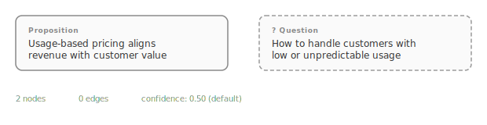
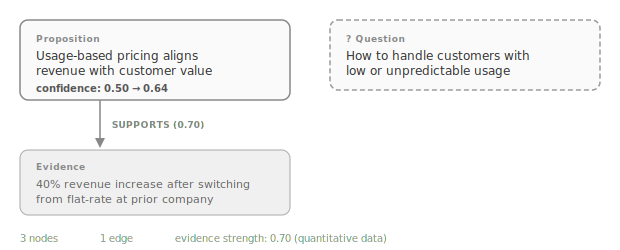
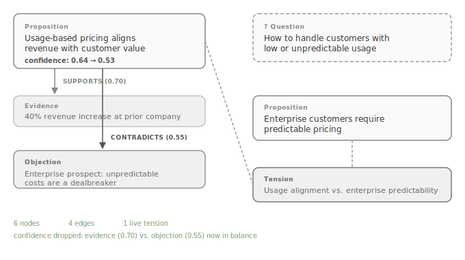
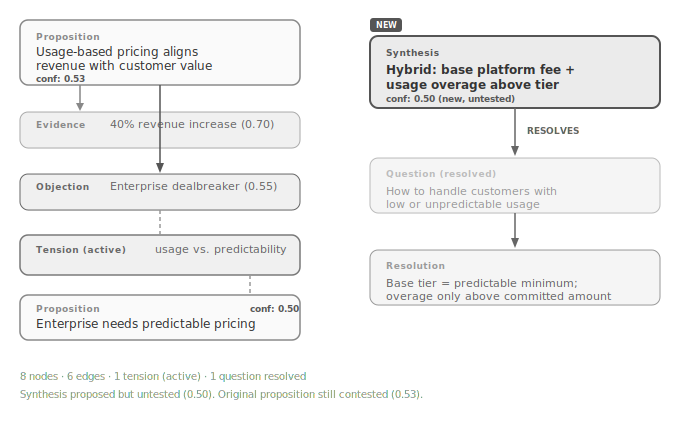

# Walkthrough: What Cairn Actually Does

A 4-turn pricing conversation, showing exactly what the classifier extracts, how the graph changes, and what the tools return. All event types, confidence values, and graph states are consistent with the actual engine behavior.

## Turn 1: Initial hypothesis

**Exchange:**

> **User:** I think we should move to usage-based pricing. It aligns our revenue with the value customers actually get. If they use more, they pay more. Simple.
>
> **Assistant:** Usage-based pricing does align incentives well. The main complexity is handling customers with low or unpredictable usage patterns. They may churn if they can't predict their monthly bill. How do you want to handle that segment?

**Classifier extracts:**

| Event | Content |
|-------|---------|
| NEW_PROPOSITION | "Usage-based pricing aligns revenue with customer value" |
| NEW_QUESTION | "How to handle customers with low or unpredictable usage who can't predict their bill" |

**Graph after turn 1:**



---

## Turn 2: Supporting evidence

**Exchange:**

> **User:** At my last company we switched from flat-rate to usage-based and saw a 40% revenue increase in 6 months. The customers who were undercharged on flat-rate started paying their fair share, and power users didn't feel penalized.
>
> **Assistant:** That's strong evidence. A 40% increase is significant, and the mechanism makes sense: flat-rate subsidizes heavy users at light users' expense. Usage-based corrects that.

**Classifier extracts:**

| Event | Content | Strength |
|-------|---------|----------|
| SUPPORT | "40% revenue increase after switching to usage-based at prior company; flat-rate was subsidizing heavy users" | 0.70 |

Strength is 0.70 (empirical data from a real deployment, not just opinion).

**Graph after turn 2:**



---

## Turn 3: Contradiction

**Exchange:**

> **User:** I just got off a call with Meridian Corp, our biggest enterprise prospect. They said flat out: unpredictable costs are a dealbreaker. Their finance team needs a fixed line item for budgeting. They won't sign usage-based.
>
> **Assistant:** That's a real constraint. Enterprise procurement often requires predictable spend. This directly challenges the pure usage-based model, at least for that segment.

**Classifier extracts:**

| Event | Content | Strength |
|-------|---------|----------|
| CONTRADICTION | "Enterprise prospect rejected usage-based pricing; unpredictable costs are a dealbreaker for their finance team's budgeting" | 0.55 |
| NEW_PROPOSITION | "Enterprise customers require predictable pricing for budget planning" |
| TENSION_IDENTIFIED | Tension between usage-based pricing and enterprise predictability requirement |

Contradiction strength is 0.55 (a single customer anecdote, but from a key prospect with a clear mechanism).

**Graph after turn 3:**



---

## Turn 4: Synthesis

**Exchange:**

> **User:** What if we do a hybrid: a base platform fee that covers a committed usage tier, then overage charges above that? Enterprise gets their predictable line item, but we still capture value from heavy usage.
>
> **Assistant:** That resolves the tension. The base fee satisfies enterprise budgeting, the overage preserves usage alignment. It also answers the low-usage question: customers on the base tier pay a predictable amount and only see variable charges if they exceed it.

**Classifier extracts:**

| Event | Content |
|-------|---------|
| SYNTHESIS | "Hybrid model: base platform fee covering a committed usage tier, plus overage charges above that tier" |
| QUESTION_RESOLVED | Resolves "how to handle low-usage customers" with "base tier provides predictable minimum, overage only above committed amount" |

**Graph after turn 4:**



---

## What the tools return

### `harness_status`

```
## Graph Stats
  total_nodes: 8
  total_edges: 6
  active: 6
  resolved: 1
  propositions: 3
  questions: 0 (1 resolved)
  tensions: 1

## Active Propositions
- [a1b2...] (confidence: 0.53, support: 1 (strongest: 0.70), challenges: 1 (strongest: 0.55))
  Usage-based pricing aligns revenue with customer value
- [c3d4...] (confidence: 0.50, support: 0, challenges: 0)
  Enterprise customers require predictable pricing for budget planning
- [e5f6...] (confidence: 0.50, support: 0, challenges: 0)
  Hybrid model: base platform fee covering a committed usage tier,
  plus overage charges above that tier

## Live Tensions
- [g7h8...] Tension between usage-based pricing and enterprise
  predictability requirement

## Resolved Questions
- How to handle customers with low or unpredictable usage
  -> Base tier provides predictable minimum, overage only above committed amount
```

### `harness_orient("pricing strategy")`

```
## Orientation: pricing strategy

SETTLED:
  (none — no proposition has strong enough evidence to be considered settled)

CONTESTED:
  - "Usage-based pricing aligns revenue with customer value"
    confidence: 0.53 | support: 1 (0.70) | challenges: 1 (0.55)
    Live tension with enterprise predictability requirement

OPEN:
  - Hybrid model proposed but untested (confidence: 0.50, no evidence yet)

RECENTLY RESOLVED:
  - How to handle low-usage customers
    -> base tier provides predictable minimum
```

### `harness_query("decision_log")`

```
## Decision Log

RESOLVED:
  Q: How to handle customers with low or unpredictable usage?
  A: Base tier provides predictable minimum, overage only above committed amount
  (resolved via synthesis in turn 4)

ACTIVE SYNTHESIS:
  Hybrid model: base platform fee + overage charges
  (proposed but not yet validated with evidence)
```

### `harness_query("disagreement_map")`

```
## Disagreement Map

TENSION: Usage-based pricing vs. enterprise predictability
  Position A: "Usage-based pricing aligns revenue with customer value"
    confidence: 0.53
  Position B: "Enterprise customers require predictable pricing"
    confidence: 0.50
  Status: ACTIVE (unresolved — hybrid synthesis proposed but tension not formally resolved)
```

---

## What this shows

After 4 exchanges, the graph captures the *state of the decision*, not a transcript:

- The original proposal was supported by data (strength 0.70) then challenged by a customer objection (strength 0.55). Its confidence reflects both.
- The tension between competing needs is tracked as a first-class object.
- The question was asked, stayed open across turns, and was resolved by the synthesis.
- An agent querying `orient("pricing")` before the next session would know: the hybrid model exists but is untested, the tension is live, and the low-usage question was already resolved. It wouldn't re-open settled ground or miss the contradiction.

This is what flat memory systems can't do. They'd return all 4 turns with equal weight and no structure.
